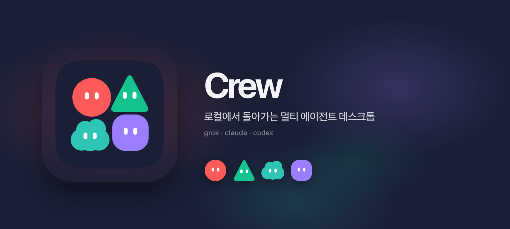
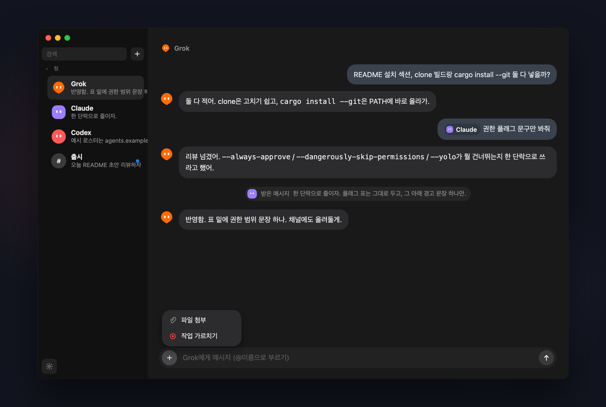
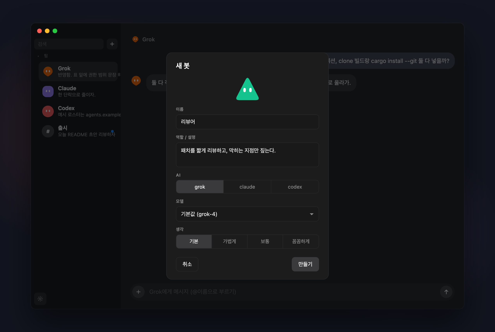
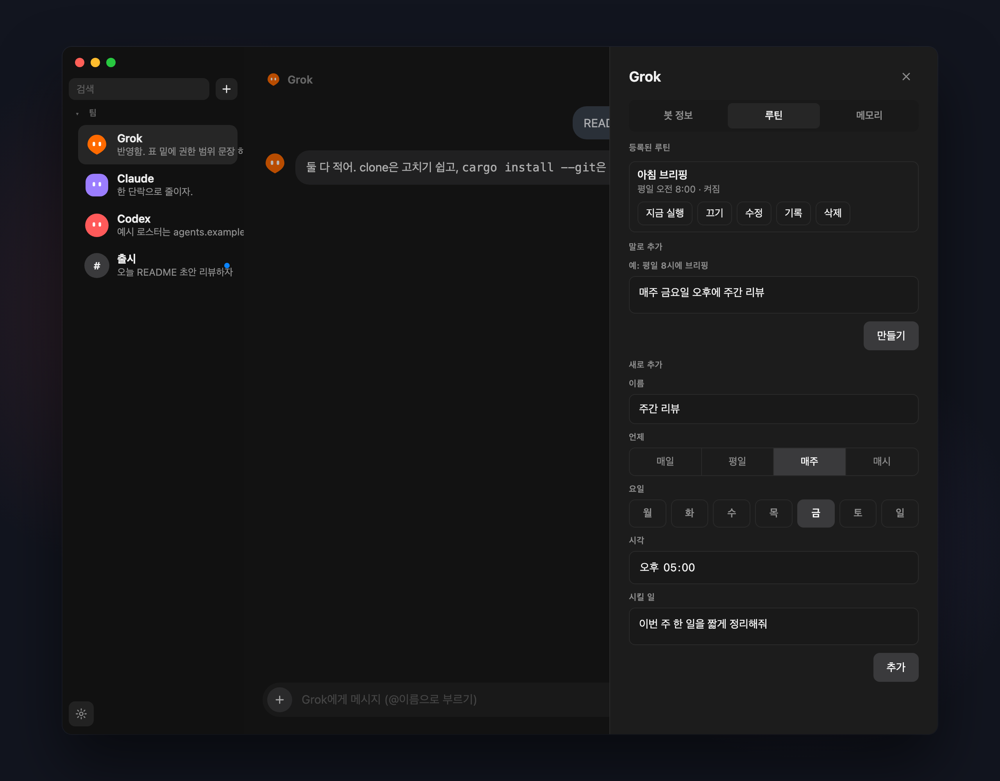

<p align="center">
  
</p>

# Crew

이미 쓰고 있는 [Grok](https://grok.com) / [Claude Code](https://docs.anthropic.com/en/docs/claude-code) / [Codex](https://github.com/openai/codex) CLI를 하나의 창 안에 봇으로 모아 주는 맥 앱이에요. 모델 API를 새로 붙이는 대신, CLI를 헤드리스로 실행하고 그 답변만 말풍선으로 보여줘요.

아직은 소스 빌드만 지원해요. GitHub Releases에 올라간 `.app`은 없어요.

<p align="center">
  
</p>

<p align="center">
  
</p>

<p align="center">
  
</p>

---

## 만든 이유

에이전트 CLI는 하나씩 창을 차지해요. 리뷰는 Claude, 구현은 Grok, 나머지는 Codex처럼 나눠 쓰다 보면 창이 계속 늘어나고, 한 봇의 결과를 다른 봇에게 넘기는 것도 결국 복사·붙여넣기가 돼요.

Grok의 봇 기능에서 영감을 받았어요. 성격과 역할을 지정한 봇을 만들어 두고 필요할 때 `@`로 부르는 방식이 좋았는데, 정작 손이 많이 가는 일은 터미널의 에이전트 CLI가 하고 있었거든요. 그래서 그 경험을 그대로 로컬 CLI 위에 올려 봤어요.

Crew는 그 CLI들을 하나의 데스크톱 안에 봇으로 모아 줘요.

- 1:1로 한 봇과 대화하거나
- 채널에 여러 봇을 모아 두고 `@이름`으로 부르거나
- 봇이 `crew tell`로 동료에게 직접 일을 넘기거나
- 정해 둔 시각에 루틴이 채널이나 봇에게 일을 맡기게 할 수 있어요

---

## 컨셉

###  봇

봇 하나는 `agents.json`의 한 항목이에요. 이름, 역할, 작업 폴더, 모델, 아바타를 갖고 있고, 메시지를 받으면 그 봇에 지정된 `cmd`를 실행해요.

기본 명령은 각 CLI의 승인 프롬프트를 건너뛰도록 되어 있어요. 데스크톱 채팅이 TUI 권한 화면에서 멈추지 않게 하기 위해서인데, 이 플래그가 어디까지 허용하는지는 알고 쓰는 편이 좋아요.

| CLI | 기본 `cmd` |
| --- | --- |
| Grok | `grok --always-approve` |
| Claude | `claude --dangerously-skip-permissions` |
| Codex | `codex --yolo` |

Grok / Claude / Codex는 턴 단위 헤드리스로 실행돼요. `-p` / `exec`의 스트리밍 JSON만 읽기 때문에 배너나 스피너, 단축키 안내가 말풍선에 섞이지 않아요. CLI 세션 id는 봇별로 보관하니까 대화를 이어서 할 수 있고, 대화를 지우면 새 세션이 열려요.

`cat` 같은 스텁은 예외로 긴 PTY 세션으로 유지해요. 테스트나 간단한 에코 봇에 쓰면 돼요.

###  채널

채널에는 멤버 봇, 브리프, 최근 대화가 있어요. 메시지를 보내면 Crew가 누가 답할 차례인지 정해 줘요.

- `@이름` / `@id` → 그 멤버가
- `@everyone` / `@all` / `@here` / `@channel` → 전원이
- 멘션이 없으면 → 마지막으로 답한 멤버가, 그마저 없으면 첫 번째 멤버가
- 봇이 멘션 없이 채널에 글을 남기면 → 아무도 답하지 않아요. 봇끼리 끝없이 주고받지 않도록요

호출된 봇에게는 채널 이름, 브리프, 최근 대화 몇 줄이 함께 전달돼요.

###  핸드오프

세션마다 `CREW_AGENT_ID`와 확장된 `PATH`가 들어가요. 시스템 프롬프트는 대략 이렇게 알려 줘요.

> 사용자가 `@id`를 쓰면 그건 **너에게** 동료를 가리키는 것이다. 이 세션에 남아라. 필요하면 직접 `crew tell <id> <text>`를 실행해라.

그래서 1:1 대화에서 `@리뷰어 이 패치 봐줘`라고 쓰면, 지금 대화 중인 봇이 먼저 일을 하고 필요할 때 리뷰어 봇에게 넘겨요. 봇 사이의 릴레이는 사용자 메시지 하나당 최대 4홉이에요.

###  메모리

대화 기록은 지우면 아카이브로 옮겨가지만, `$CREW_HOME/memory/<id>.md`는 그대로 남아요. 다음 턴에 Grok은 `--rules`로, Claude는 `--append-system-prompt`로 다시 넣어 줘요. 봇을 복제하면 메모리도 함께 복사되고, 봇을 삭제하면 메모리 파일도 같이 지워져요.

---

## 주요 기능

**채팅**

- 봇·채널 사이드바, 그룹, 드래그 앤 드롭, 검색 (`⌘K`)
- 스트리밍 말풍선, 연속 답변 분리, 마크다운, 로컬 이미지·파일 경로
- `@멘션` 칩, 파일 첨부, `/스킬` 문구 삽입
- 봇이 작업 중일 때 보낸 메시지는 순서대로 대기해요. 봇당 최대 32개
- 중지 (`⌘.` 또는 `stop` / `중지` / `멈춰`). 확인이 필요할 땐 한 번 허용 / 거부
- 도구 호출은 접힌 카드로 보여 주고, 긴 핸드오프도 접을 수 있어요
- 읽지 않은 대화 표시, Dock 배지, 작업 완료·차단·루틴 실패 알림

**봇**

- Grok / Claude / Codex 중에서 선택. 모델·생각(effort)·역할·작업 폴더 설정
- Grok Bot 스타일의 도형 아바타 (원, 물방울, 둥근 사각형, 육각형, 삼각형, 구름, 알약, 다이아몬드, 오각형, 별, 하트) + 색상. 사진으로 바꿀 수도 있어요
- 작업 중에는 궤도 애니메이션, 확인을 기다릴 땐 회전 링
- 복제, 대화 지우기 (루틴도 함께 지울지 선택), 삭제

**채널**

- 멤버·이름·브리프 설정
- 채널 전용 루틴. 주소는 `#채널이름`
- 채널에서 작업 중인 멤버 확인. 알림을 누르면 그 채널로 이동해요

**루틴**

- 5필드 cron, 또는 `평일 8시에 브리핑` 같은 한글/영어 문장
- 매일 / 평일 / 매주 / 매시 피커, 지금 실행, 일시정지, 최근 실행 기록
- 실패한 실행도 그 분(minute)의 슬롯을 쓴 것으로 쳐요. 같은 분에 다시 실행되지 않도록요

**스킬**

- 설정에서 이름과 본문을 마크다운으로 저장 (`$CREW_HOME/skills/<이름>.md`)
- 입력창에 `/이름`을 치면 본문이 들어가요

**앱**

- 한국어 / English
- 다크 / 라이트 / 시스템 (맥 외관 설정)
- 단축키 오버레이 (`⌘/`, 또는 입력창 밖에서 `?`)

---

## 요구 사항

| 항목 | 내용 |
| --- | --- |
| OS | macOS (Unix 소켓, `~/Library/Application Support`, 트래픽 라이트 타이틀바) |
| Rust | stable (`rustup`). rustc 1.95에서 빌드를 확인했어요 |
| Node.js | UI 빌드에 필요해요. npm이 `PATH`에 있으면 돼요 (Node 20+) |
| Xcode CLT | Tauri 2 / WKWebView. `xcode-select --install` |
| 에이전트 CLI | `grok`, `claude`, `codex` 중 쓸 것만. Crew는 모델을 내장하지 않아요 |

바이너리는 아래 경로에서도 찾아요.

`~/.grok/bin`, `~/.local/bin`, `~/.cargo/bin`, `/opt/homebrew/bin`, `/usr/local/bin`

---

## 설치

미리 빌드된 설치 파일은 아직 없어요. 저장소를 받아서 직접 빌드하면 돼요.

### 1. 도구

```bash
# Rust
curl --proto '=https' --tlsv1.2 -sSf https://sh.rustup.rs | sh

# Xcode Command Line Tools (아직 없다면)
xcode-select --install
```

Node는 [nodejs.org](https://nodejs.org)에서 받거나 `brew install node`로 설치하면 돼요.

### 2. 에이전트 CLI (필요한 것만)

각 도구의 공식 설치 방법을 따른 뒤, 터미널에서 해당 명령이 실행되는지만 확인하면 돼요.

```bash
grok --version
claude --version
codex --version
```

### 3. Crew 빌드

**저장소에서 빌드**

```bash
git clone https://github.com/im-ian/crew.git
cd crew
cargo build --release -p crew
```

바이너리: `target/release/crew`

PATH에 넣으려면:

```bash
install -m 755 target/release/crew "$HOME/.local/bin/crew"
# 또는
cargo install --path crates/crew --locked
```

`cargo install`은 `~/.cargo/bin/crew`에 설치해요. rustup으로 설치했다면 이미 PATH에 잡혀 있어요.

**Git에서 바로 설치**

```bash
cargo install --git https://github.com/im-ian/crew.git --locked crew
```

두 방법 모두 `build.rs`가 `crates/crew/ui`에서 `npm install`과 `npm run build`를 실행해요. 첫 빌드는 Node 의존성 때문에 시간이 좀 더 걸려요.

### 4. 실행

```bash
crew
```

인자 없이 실행하거나 `crew app`을 쓰면 데스크톱 창이 열려요. 데몬이 떠 있지 않으면 같은 바이너리가 백그라운드 데몬을 함께 띄워요.

창만 닫으면 데몬은 남아 있을 수 있어요. 완전히 종료하려면:

```bash
crew stop
```

창은 한 번에 하나예요. 이미 실행 중인 Crew가 있다면 먼저 종료하고 다시 여는 편이 안전해요.

---

## 첫 실행

데이터 홈은 기본적으로 여기예요.

```
~/Library/Application Support/crew
```

`CREW_HOME`을 지정하면 그 디렉터리를 사용해요.

`agents.json`이 아직 없으면 저장소의 [`agents.example.json`](agents.example.json)을 복사해서 시작해요. 예시 로스터는 이래요.

| id | 이름 | 명령 | 작업 폴더 |
| --- | --- | --- | --- |
| `grok` | Grok | `grok --always-approve` | `/tmp/crew-demo/grok` |
| `shell` | Shell | `cat` | `/tmp/crew-demo/shell` |

`examples` 블록의 Claude / Codex는 참고용이라 자동으로 등록되지는 않아요. 앱의 **새 봇**이나 CLI로 추가하면 돼요.

Grok이 PATH에 있다면 예시 `grok` 봇에게 바로 말을 걸 수 있어요. 없다면 새 봇을 만들면서 설치해 둔 CLI를 고르면 돼요.

---

## 데스크톱 사용법

1. `crew`를 실행해 창을 열어요.
2. 사이드바에서 봇을 고르거나, **새 봇** (`⌘N`)으로 Grok / Claude / Codex 봇을 만들어요.
3. 여러 봇을 함께 쓰려면 **새 채널** (`⌘⇧N`)을 만들고 멤버를 넣어요.
4. 메시지, `@멘션`, 파일 첨부 (`⌘U`), `/스킬`을 사용해요.
5. `⌘I`로 봇/채널 정보를 봐요 (역할, 모델, 메모리, 작업 폴더, 아바타).
6. `⌘⇧R`로 루틴을 관리해요.

### 단축키

입력 중에도 `⌘` 조합은 그대로 동작해요. `?`는 입력창 밖에서만 먹혀요.

| | |
| --- | --- |
| `⌘/` | 단축키 |
| `⌘,` | 설정 |
| `⌘K` | 검색 |
| `⌘J` | 입력창 |
| `⌘⌥↑` / `⌘⌥↓` | 이전 / 다음 대화 |
| `⌘⇧↓` | 맨 아래 |
| `⌘N` | 새 봇 |
| `⌘⇧N` | 새 채널 |
| `⌘I` | 정보 |
| `⌘⇧R` | 루틴 |
| `⌘.` | 중지 |
| `⌘U` | 파일 첨부 |
| `⌘↩` | 한 번 허용 |
| `⌘⌫` | 거부 |

---

## CLI

CLI도 데스크톱과 같은 데몬, 같은 `agents.json`을 써요. 데몬이 꺼져 있어도 `agent` / `channel` / `memory` / `routine`의 설정 변경은 파일에 바로 반영돼요. `tell`, `send`, `reset`, `routine run`처럼 살아 있는 세션이 필요한 명령은 데몬을 띄운 뒤에 실행해요.

봇 세션 안에서 `crew tell`을 실행하면 `CREW_AGENT_ID`가 보낸 사람이 돼요. 에이전트 프로세스가 데몬을 새로 띄우지는 않아요.

```bash
crew                    # 데스크톱
crew app
crew daemon             # 백그라운드 서버만
crew stop

crew agent list
crew agent add review --cli claude --name "리뷰어"
crew agent add impl --cli grok --cwd ~/Projects/app
crew agent add hack --cli codex
crew agent set grok --model grok-4 --effort high --shape circle --color "#ff6a00"
crew agent clone grok --name "Grok 복사본"
crew agent remove shell

crew tell grok 이 파일의 테스트를 보강해줘
crew tell review --from grok 방금 패치 리뷰해줘
crew tell --channel frontend @grok 오늘 보드 요약해줘

crew channel add frontend --name "프론트엔드" --members grok,review
crew channel send frontend 스탠드업 시작
crew channel set frontend --brief "이 방은 UI만"

crew routine add grok --name "아침" --schedule "0 8 * * 1-5" --prompt "오늘 할 일 브리핑"
crew routine add '#frontend' --name "스탠드업" --schedule "0 9 * * 1-5" --prompt "어제 한 일"
crew routine run grok 아침

crew memory show grok
crew memory set grok 사용자는 한국어로 짧게 답하길 좋아한다
crew memory append grok 이 레포는 워크스페이스 루트가 crew 다

crew messages grok
crew reset grok
crew reset grok --drop-routines
```

`crew agent add`에는 `--cli grok|claude|codex` 또는 `--cmd …`가 필요해요. `--cmd`를 주면 `--cli`는 무시돼요. 작업 폴더를 생략하면 `/tmp/crew-demo/<id>`가 돼요.

채널 루틴의 대상은 `#채널id` 형식으로 적어요.

---

## 데이터 위치

기본 경로: `~/Library/Application Support/crew`  
변경하려면: `CREW_HOME`

| 경로 | 내용 |
| --- | --- |
| `agents.json` | 봇·채널·루틴 |
| `groups.json` | 사이드바 그룹 |
| `locale` | `ko` 또는 `en` (알림·CLI 라벨) |
| `roster.md` | 봇에게 주입되는 최신 봇 명단 |
| `memory/<id>.md` | 대화를 지워도 남는 기억 |
| `skills/<이름>.md` | `/이름` 스킬 |
| `transcripts/<id>.jsonl` | 1:1 대화 |
| `channels/<id>.jsonl` | 채널 대화 |
| `cli-sessions/<id>` | Grok/Claude/Codex 세션 id |
| `archive/` | 지운 대화 |
| `uploads/` | 첨부 파일 |
| `crew.sock` / `crew.pid` | 데몬 |
| `crew.log` | 데몬 로그 |

---

## 개발

```bash
git clone https://github.com/im-ian/crew.git
cd crew
cargo run -p crew          # 디버그. UI는 Vite http://127.0.0.1:1420
cargo test -p crew
(cd crates/crew/ui && npm test)
```

디버그 빌드는 `ui/dist`가 있으면 프론트엔드를 다시 번들하지 않고 창을 Vite에 연결해요. 릴리스 빌드는 `npm run build`로 `ui/dist`를 만들어요.

```
crates/crew/src/     Rust: CLI, 데몬, 헤드리스/PTY, Tauri 커맨드
crates/crew/ui/src/  React 19 UI
```

핵심은 데몬이에요. 데스크톱 앱과 `crew` CLI가 Unix 소켓으로 JSON 요청을 보내면, 데몬이 에이전트 프로세스를 실행해요.

---

## 라이선스

MIT. `Cargo.toml`의 `workspace.package.license`와 동일해요.
